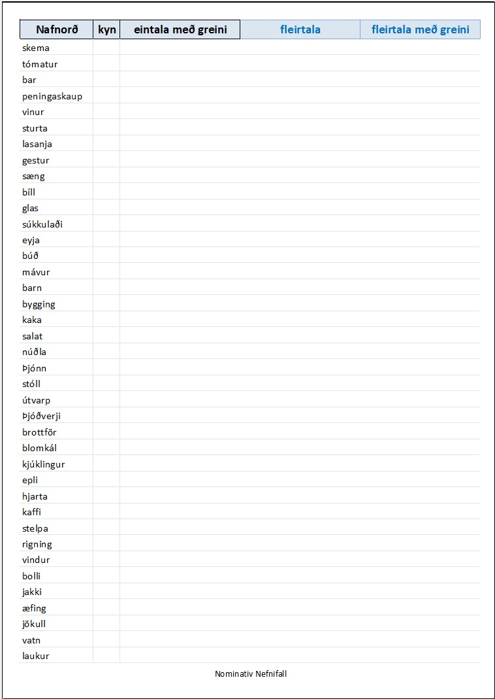

# Generator - exercise excel sheets to train icelandic nouns and grammar

app to generate excel sheets with exercises to train icelandic vocabulary and grammar.

Based on a yaml orðabók (vocabulary) in /etc folder this simple app generates an excel file with sheets of words taken from `etc/ordabok.yaml`.

First columns contains 40 nouns (icelandic: nafnorð).
The student has to fill following:

- gender of the word in second column
- third column: singular with article
- fourth column: plural without article
- fifth column: plural with article
  
The first sheet is to train nominativ, the second sheet to train accusativ.

Your own word list can be entered in `etc/ordabok.yaml` and thus adapted to your own learning progress.

Adjust output folder in config file `etc/ordabok.yaml` by changing `learningsheet_path`.

## Prerequisites

python 3.6 or higher  
python modules as listed in requirements.txt

## How to execute

``` powershell
pip install -r requirements.txt
python .\src\createnafnordsheet\app.py
```

## Need help to solve exercises?

On [Árni Magnússon Institute for Icelandic Studies web site](https://bin.arnastofnun.is) you can search for correct grammar. Great web site!

## Output Example


